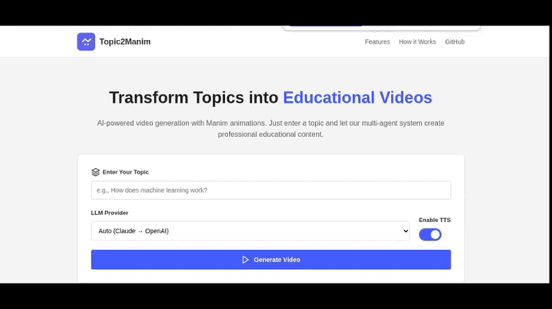
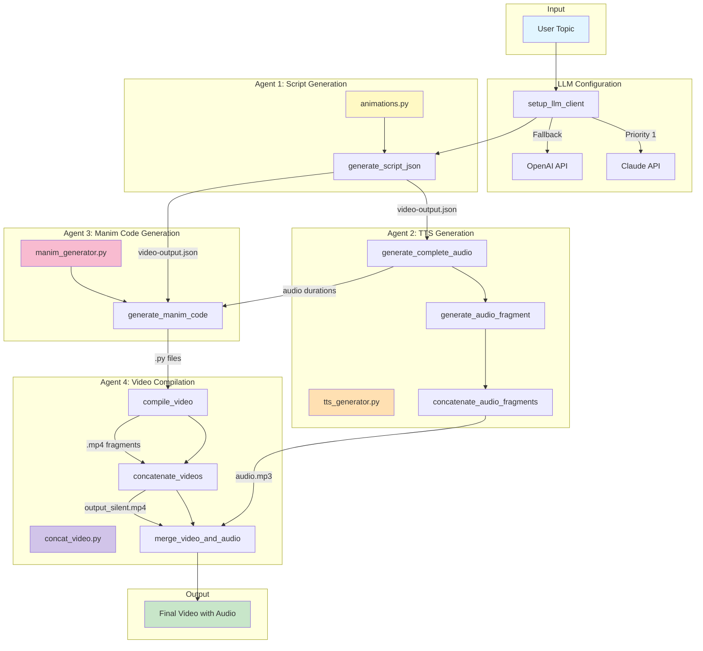
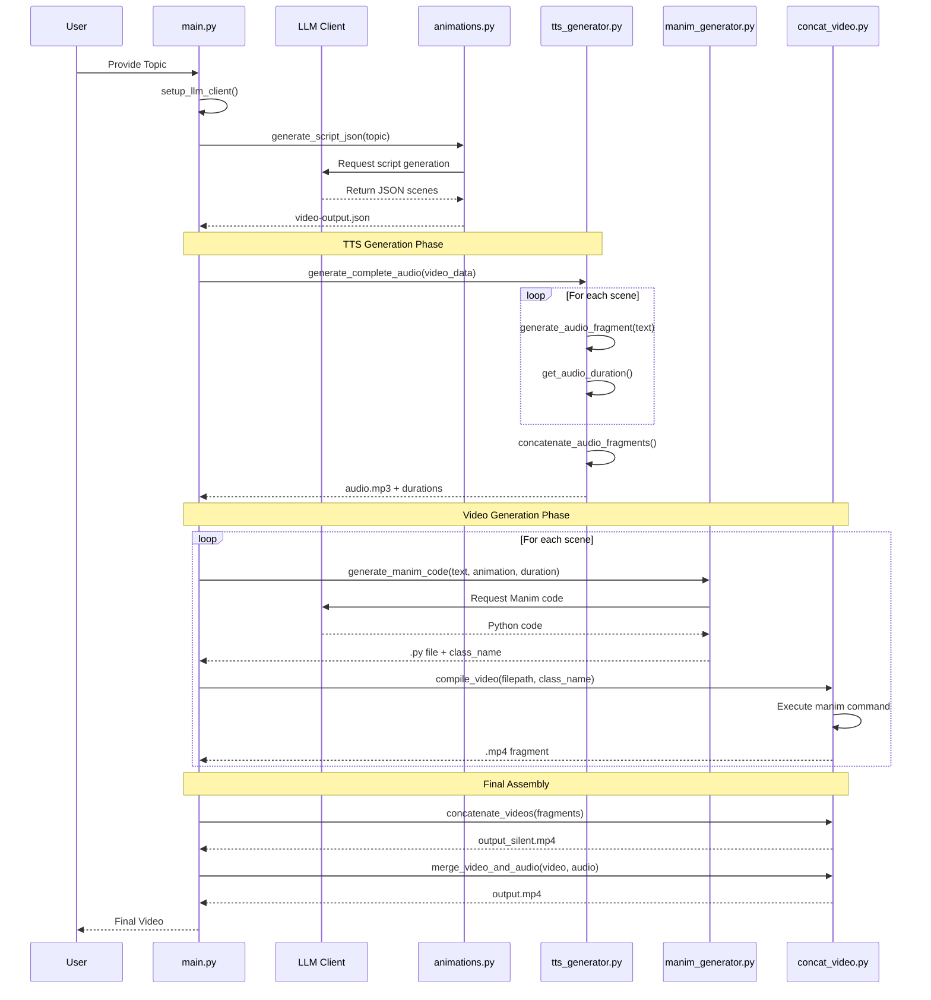
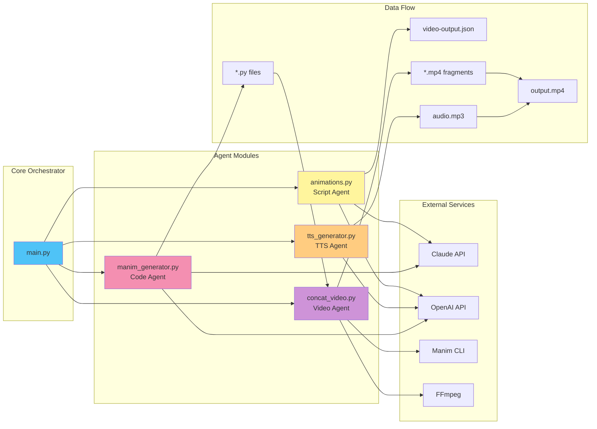
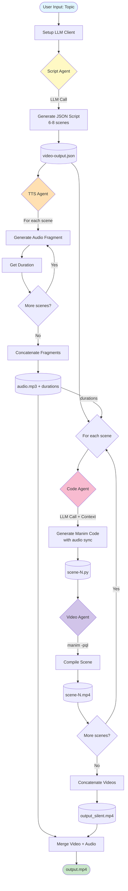
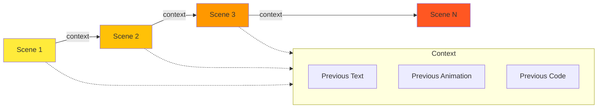

<div align="center">


# Topic2Manim

</div>

Automatic educational video generator using AI and Manim. Converts any topic into a professional animated video with narration and mathematical visualizations.

<div align="center">
  
## User Interface



</div>

<div align="center">
  
## Examples

</div>

> propmt: How do machines learn to recognize MNIST dataset numbers?
> 
> model: claude-sonnet-4-5-20250929
> 
> response:

<div align="center">


</div>

> propmt: What is a Markov chain and how are they related to LLMs?
> 
> model: claude-sonnet-4-5-20250929
> 
> response:

<div align="center">


</div>

> propmt: How does Cramer's rule work for system of linear equations?
> 
> model: claude-sonnet-4-5-20250929
> 
> response:

<div align="center">


</div>

> propmt: how chat gpt works?
> 
> model: gpt-5.2
> 
> response:

<div align="center">


</div>

> propmt: how tokenization works in chat gpt?
> 
> model: gpt-5.2
> 
> response:

<div align="center">


</div>

## Features

- **Multi-LLM Support** with automatic fallback (OpenAI GPT, Claude)
- **Automatic script generation** using advanced language models
- **Educational animations** with Manim Community Edition
- **Multi-language support** (automatically detects topic language)
- **Optimized videos** of ~60 seconds with multiple scenes
- **Automatic concatenation** of fragments into final video

## Architecture

### System Overview

Topic2Manim is a multi-agent system that orchestrates several specialized components to transform a topic into an educational video. The system follows a pipeline architecture where each agent has a specific responsibility.



### Agent Interaction Flow



### Module Structure



### Data Flow Architecture



### Context Propagation



Each scene receives context from the previous scene to maintain visual and narrative continuity.


## Installation

```bash
git clone https://github.com/mateolafalce/topic2manim.git
cd topic2manim

pip install -r requirements.txt

cp .env.example .env
```

## Usage

Start the Flask server:

```bash
python main.py
```

Then open your browser and navigate to:
```
http://localhost:5000
```

or 

```bash
docker compose up
```


